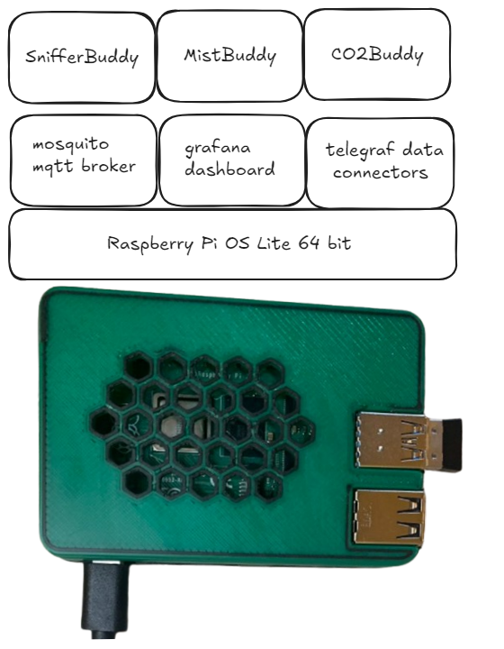

# 👋 About the GrowBase Project

GrowBase is a Raspberry Pi-based system connected to a local wi-fi that serves as the base station for the [MistBuddy-Lite](https://github.com/solarslurpi/mistbuddy_lite), CO2Buddy, and SnifferBuddy projects. It provides a centralized platform for monitoring and controlling environmental conditions in grow environments. _All data remains local. Nothing is sent to a cloud service._

<div style="text-align: center;">

</div>


# 🙏 Thanks to Those That Went Before
- **THANK YOU Adafruit**: [Adafruit](https://www.adafruit.com/) is an incredible company that consistently inspires and empowers the maker community with innovative products and resources. Their commitment to education and open-source hardware is unmatched, thanks to the vision and leadership of their founders. Thank you for making such a positive impact on so many lives.
- **THANK YOU Alex Ellis**: for the [Getting Started with Docker on Raspberry Pi](https://blog.alexellis.io/getting-started-with-docker-on-raspberry-pi/) blog post.  
- **THANK YOU Raspberry Pi Foundation**: For creating an affordable, versatile computing platform that serves as the heart of this project.

# 🔩 Build the GrowBase
>**CAVEAT**: I have been using a build using these parts. As in "it works for me." I am not a professional. I am sharing with in hopes it can benefit others. I am not responsible for any damages to your home or property.

## 💰 BoM

The supplies needed to build GrowBase include:

| Component | Cost | Reason |
|-----------|------|--------|
| [Rasp 4 w 4GB](https://www.adafruit.com/product/4296) | $55.00 | This is what I use.  It is working well.
| [USB-C Power Supply for Rasp Pi](https://www.adafruit.com/product/4298) | $7.95 | Official Raspberry Pi Power Supply 5.1V 3A with USB C one with data wires. __Note: the Raspberry Pi 4 (5V via USB type-C up to 3A) uses a different power supply than the Raspberry Pi 3 (5V via micro USB up to 2.5A)__
| [micro SD card](https://amzn.to/3W3yvHa) | $16 | Two amazon basics 64 GB.
| enclosure | pennies | The model I chose is [Malolo's](https://www.thingiverse.com/thing:3723561) [screw-less](https://www.thingiverse.com/thing:3723561) snap-fit[ Raspberry Pi](https://www.thingiverse.com/thing:3723561) 3 and 4 cases. <br>Specifically the one-color slot base and the two-color hex top.

## 🛠️ Build the Enclosure

| Component | File
|-----------|------|
| top | The top can be multicolored yet does not require a 3D printer that can print multiple filaments at once.<br>The two files include [Pi4 Top Hex color 1](../enclosures/GrowBuddy/Pi4_Top_Hex_MM2_Color1.stl) and [Pi4 Top Hex color 2](../enclosures/GrowBuddy/Pi4_Top_Hex_MM2_Color2.stl).  If you are unsure how to print for <br>multi-color, Malalo has provide [multi-color printing directions](https://www.thingiverse.com/thing:3719217)
| bottom | [Pi4 Bottom with slots](../enclosures/GrowBuddy/Pi4_Bottom_Slots_SM.stl)
#### Raspberry Pi 3 Case
Raspberry Pi 3 (I've tried it.  But better just to start with the Raspberry Pi 4):
| Component | File |
|-----------|------|
| top | Similar to the top for the Raspberry Pi 4, two files are used.  The first is [Pi3 Top Hex color 1](../enclosures/GrowBuddy/Pi3_Top_Hex_MM2_Color1.stl).<br>The second is [Pi3 Top Hex color 2](../enclosures/GrowBuddy/Pi3_Top_Hex_MM2_Color2.stl)
| bottom | [Pi3 Bottom with slots](../enclosures/GrowBuddy/PI3_Bottom_Slots_SM.stl)

Fit the Raspberry Pi into the enclosure after it has been printed.


## 🖥️ Install the Software

### 1. Install Raspberry Pi OS

   The easiest way is to use the [Raspberry Pi imager](https://www.raspberrypi.com/software/) on the micro SD card.
      - Install the latest Raspberry Pi Lite 64 bit OS.
      - Adafruit has [a nice walk through](https://learn.adafruit.com/raspberry-pi-zero-creation/using-rpi-imager).
      - Make sure to set your wifi, host, and other info.

### Verify the Install

Put the micro SD card into the Raspberry Pi and power up the Raspberry Pi. Open up a terminal window and try to `ssh` in:
```
ssh pi@<ip address on the Raspberry Pi>
```
After entering your password, you should be in the command prompt:
```
pi@<ip address>:~ $
```
If you cannot reach your GrowBase from your Mac/PC, first check to see if the raspberry pi is on your home wifi by using a utility like [Angry IP](https://angryip.org/).  If it is not, perhaps [this troubleshooting guide](raspi-nowifi) can help.

### 2. Reduce GPU Memory
GrowBase runs a headless install of Raspberry Pi and is not doing any video or audio processing.  Processing of GrowBase tasks can improve by editing `/boot/config.txt` and adding this line:
```bash
gpu_mem=16
```
make sure to save the file after editing.

### 3. Set a Static IP
The most error free method of connecting to another machine on the WiFi is setting a static IP on the machine. The method to set a static IP has completely changed in `bookworm` as it was done in previous version of the Raspberry Pi OS.  This discussion focuses on setting a static IP address for a Raspberry Pi running `bookworm`.

1. Verify the Raspberry Pi is running `bookworm`:
```bash
 $ hostnamectl
 Static hostname: beanie
       Icon name: computer
      Machine ID: e1f7b307406342e29e487e0d9df67c0d
         Boot ID: e448da74cad145d59b4bd535b8afc307
Operating System: Debian GNU/Linux 12 (bookworm)
          Kernel: Linux 6.6.31+rpt-rpi-2712
    Architecture: arm64
```
2. Gather network info
- Let's go ahead and use the current IP address. We will also need the default gateway:
```bash
$ ip route
default via 192.168.68.1 dev wlan0 proto dhcp src 192.168.68.67 metric 600
172.17.0.0/16 dev docker0 proto kernel scope link src 172.17.0.1 linkdown
192.168.68.0/22 dev wlan0 proto kernel scope link src 192.168.68.67 metric 600
```
The default gateway is 192.168.68.1 and the current IP address is 192.168.68.67.

4. Use nmtui
There is a new tool in `bookworm`, nmtui. `$ sudo nmtui`.  Choose to `Edit the connection`. Go to the WiFi configuration page.  Set IPv4 CONFIGURATION to `<Manual>`. Set the gateway and DNS Servers IP addresses.  Tab to the bottom and hit `<Enter>` on `OK`. Reboot once out of the utility.


(The rest of the documentation will be completed as the other Buddies come on line).
